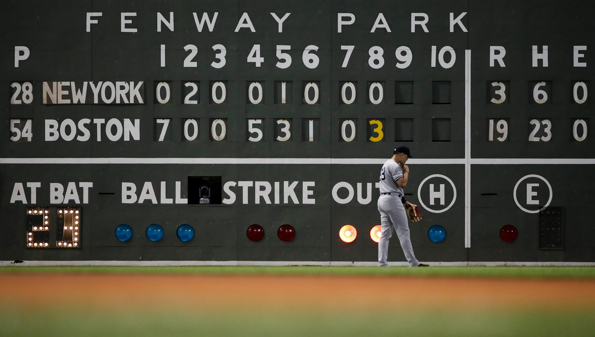
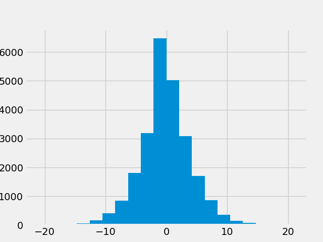
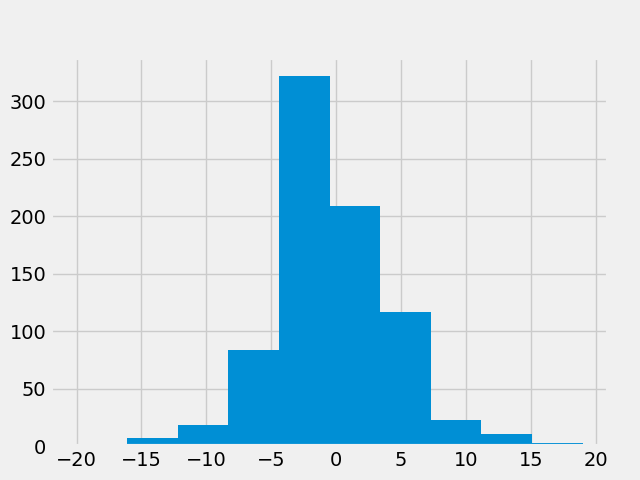

# Blowout Bonanza?
By Austin Zimmerman

<p align="center">
       

```
The information used here was obtained free of
charge from and is copyrighted by Retrosheet.  Interested
parties may contact Retrosheet at "www.retrosheet.org".

Data dictionary: https://www.retrosheet.org/gamelogs/glfields.txt

Data source: https://www.retrosheet.org/gamelogs/index.html
```
**Note: If you are only here to read about sweet sweet data pipelines, skip to the end you kinky weirdo**

Stop me if you've heard this one before: "*X* is just so different in 2020."  Yeah... I thought so. 2020 has been an atypical year for everything from weather to social conventions to professional sports.  As I cast my daily dragnet across the murky depths of the internet each day before going to sleep, I see how the COVID-19 Pandemic has changed each of this things, and more, in really substantial ways.  One thing that I have seen recently has to do with my most favoritest thing, my first love, the Leela to my Fry, the Simon to my Garfunkel, the, *ahem*, pineapple to my pizza, Major League Baseball.

What I have heard, and even experienced, myself, is that it seems like lopsided games than ever.  In a season the did not begin until *mid-July*, and that will feature a *16-team* playoff structure, it would not be surprising if 2020 were having a significant effect on the way these games were being managed and played.  Thanks to the incredible work by years of volunteers at [retrosheet](www.retrosheet.org), I have more game data than I could ever imagine.  I have chosen to compare 2020 (thanks to [Baseball Reference](https://www.baseball-reference.com/leagues/MLB/2020-schedule.shtml)) with the past 9 seasons (2010-2019 inclusive) of play to see if the effect I suspect can be checked.

This project is *not* a study of the overall run-scoring environment of baseball, which has very much been covered by people with oodles more brains than me.


### Pre 2020
According to Retrosheet, MLB played 24,297 games from 2010-2019.  Aside from [four](https://www.baseball-reference.com/bullpen/Tie) ties, all other MLB games came to a conclusion in this period with an MOV (Margin of Victory) between 1 and 21.  Below is a look at the distribution of MOV for this period.
<p align="center">
       

### 2020 "Season"
At the time of writing, MLB has played 719 games in 2020.  The results of those games are distributed in a pretty similar way.

<p align="center">
       

### Briefly: What is a Blowout?
After a bit of crowdsourcing, I felt pretty good about deciding that any game in which the winning team finished 7 or more runs ahead of the loser is a blowout, and if you don't, email "me" at tippingpitchespod@gmail.com.

## Comparison and Analysis

Broken down by MOV, the results for the two samples are as follows:

| Margin of Victory | Percent of Total Games (Pre-2020) | Percent of Total Games (2020) |
|-------------------|-----------------------------------|-------------------------------|
| 1                 | 28.9%                             | 28.2%                         |
| 2                 | 18.4%                             | 17.0%                         |
| 3                 | 14.2%                             | 15.2%                         |
| 4                 | 11.6%                             | 11.7%                         |
| 5                 | 8.3%                              | 8.9%                          |
| 6                 | 6.1%                              | 6.3%                          |
| 7+                | 12.4%                             | 12.8%                         |

So, it looks like there is a marginal increase in blowout rate (which is going to sound even more silly each time I type/you read it).  While it is possible that this is the result of serious changes in the way the game is being played this year, it could very well be the result of statistical noise and all of our collective brains just kinda shrugging and saying "yeah, well everything just *feels* different." Given the small sample size for 2020 and, uh, the existence of 2020, I am leaning towards the latter.

### Statistical Test
In this case, as alluded to above, my null hypothesis is that there is no statistically significant difference in how bad teams are getting beat in 2020.  Due to both samples having n > 30 and a (pretty darn close to) normal distribution of MOV, I chose a two-sample Z Test.  Based on the results of this test (p-value of 0.54), I can confidently say that we fail to reject the null hypothesis.  In other words, things are definitely weird, but baseball is more or less the same.


<p align="center">
<table>
<tr><th> </th><th> </th></tr>
<tr><td>



</td><td>




</td></tr> </table>
</p>

## How did I do this?
oh wouldn't you like to know, stay tuned for some #process

As mentioned above, the pre-2020 data was easily and publicly accessible via retrosheet in the form of csv files.  I used `pandas` to load in select columns of this data (retrosheet's game logs contain far more detail than I needed) and do a bit of manipulation to get the feature I was really after, Margin of Victory (MOV).

The 2020 data was scraped from Baseball-Reference and cleaned up using Python's `Beautiful Soup` library, and then loading into `pandas` for the same featurization as the pre-2020 data.

Once all the data was safely in pandas, 

I used `MatplotLib` for all visualizations.


Image Credits:
https://www.gannett-cdn.com/presto/2019/07/26/PNJM/b6a345c6-cc86-41b7-b62d-90b81f910566-AP_19207093293088.jpg